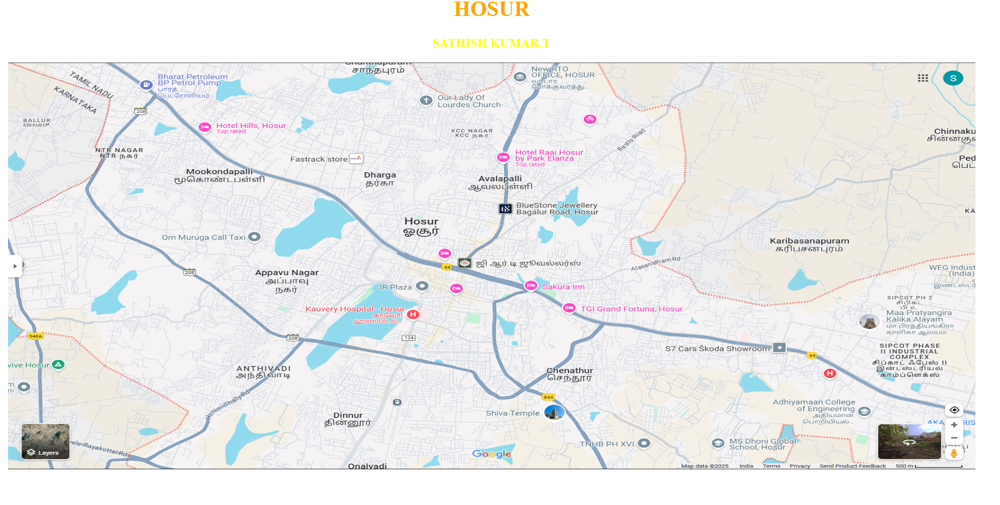
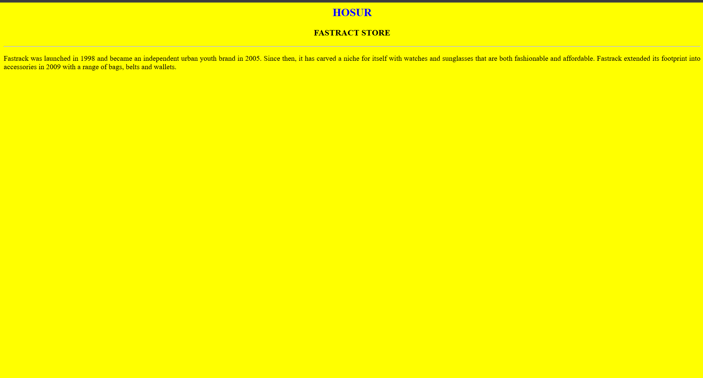
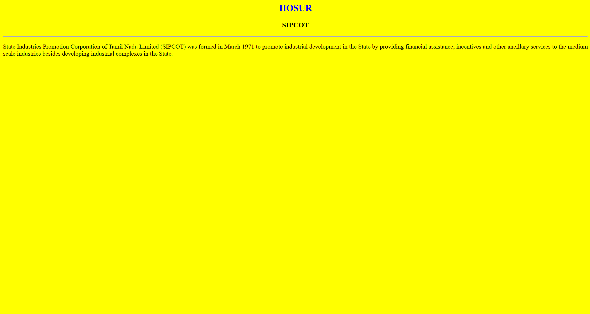
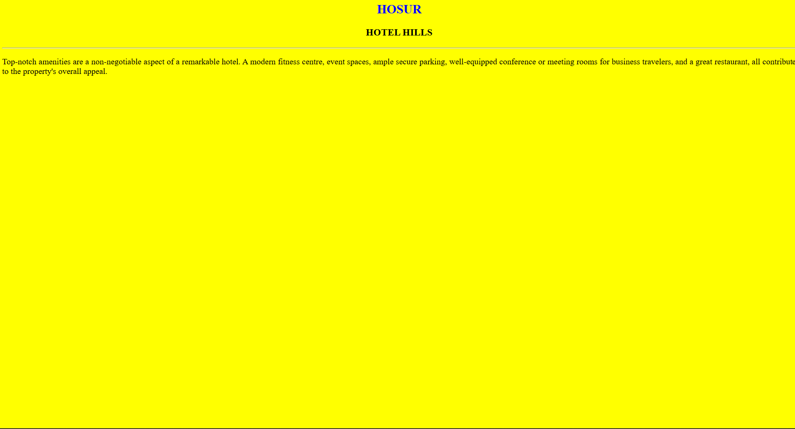
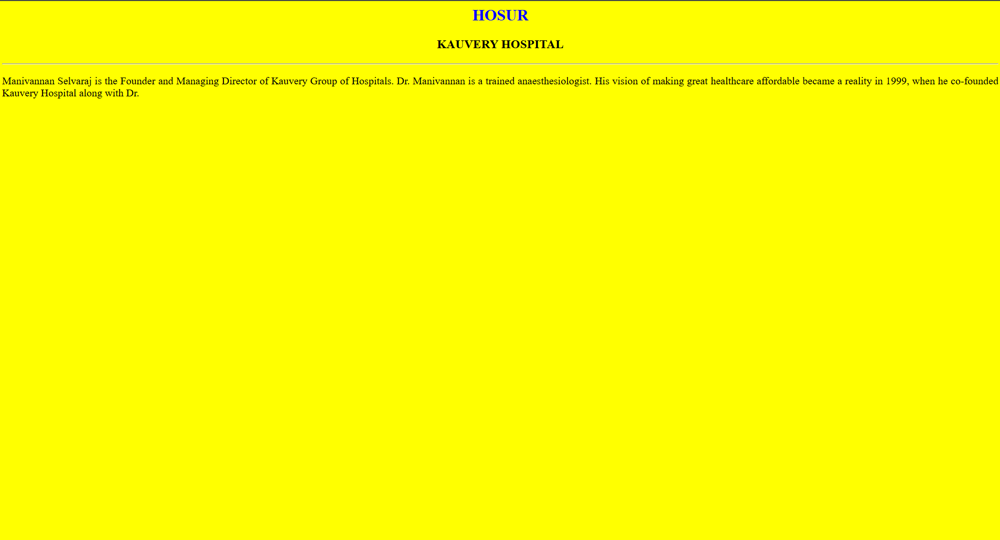
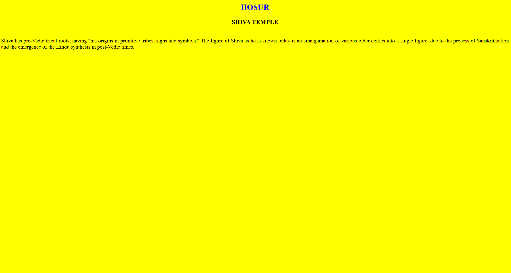

# Ex04 Places Around Me
## Date:26/04/2025
## Reg No:212224100053

## AIM
To develop a website to display details about the places around my house.

## DESIGN STEPS

### STEP 1
Create a Django admin interface.

### STEP 2
Download your city map from Google.

### STEP 3
Using ```<map>``` tag name the map.

### STEP 4
Create clickable regions in the image using ```<area>``` tag.

### STEP 5
Write HTML programs for all the regions identified.

### STEP 6
Execute the programs and publish them.

## CODE
```
map.html
<html>
    <head>
       <title>CITY</title>
    </head>
    <body>
        <h1 align="center">
            <font color="orange"><b>HOSUR</b></font>
        </h1>
        <h3 align="center">
        <font color="yellow"><b></b>SATHISH KUMAR.T</font>
        </h3>
        <CENTER>
            
            <map name="MyCity">
            <area shape="rect" coords="536,235,733,280" href="store.html" title="FASTRACK STORE">
            <area shape="rect" coords="1677,777,1919,1673" href="sipcot.html" title="SIPCOT 2">
            <area shape="rect" coords="364,120,531,254" href="hotel.html"  title="HOTEL HILLS">
            <area shape="rect" coords="796,746,847,604" href="hospital.html" title="KAUVERY HOSPITAL">
            <area shape="rect" coords="1141,909,955,967" href="temple.html" title="SHIVA TEMPLE">
    
            </map>
        </CENTER>
    </body>
</html>


store.html

<html>
    <BODY bgcolor="yellow">
    <h2 align="center"><font color="BLUE">HOSUR</h2></FONT>
    <H3 align="center">FASTRACT STORE</H3>
    <HR>
    <p align="justify">Fastrack was launched in 1998 and became an independent urban youth brand in 2005. Since then, it has carved a niche for itself with watches and sunglasses that are both fashionable and affordable. Fastrack extended its footprint into accessories in 2009 with a range of bags, belts and wallets.</p>
</BODY>
</html>
</html>

sipcot.html

<html>
    <BODY bgcolor="yellow">
    <h2 align="center"><font color="BLUE">HOSUR</h2></FONT>
    <H3 align="center">SIPCOT</H3>
    <HR>
    <p align="justify">State Industries Promotion Corporation of Tamil Nadu Limited (SIPCOT) was formed in March 1971 to promote industrial development in the State by providing financial assistance, incentives and other ancillary services to the medium scale industries besides developing industrial complexes in the State.</p>
</BODY>
</html>


hotel.html

<html>
    <BODY bgcolor="yellow">
    <h2 align="center"><font color="BLUE">HOSUR</h2></FONT>
    <H3 align="center">HOTEL HILLS</H3>
    <HR>
    <p align="justify">Top-notch amenities are a non-negotiable aspect of a remarkable hotel. A modern fitness centre, event spaces, ample secure parking, well-equipped conference or meeting rooms for business travelers, and a great restaurant, all contribute to the property's overall appeal.</p>
</BODY>
</html>


hospital.html

<html>
    <BODY bgcolor="yellow">
    <h2 align="center"><font color="BLUE">HOSUR</h2></FONT>
    <H3 align="center">KAUVERY HOSPITAL</H3>
    <HR>
    <p align="justify">Manivannan Selvaraj is the Founder and Managing Director of Kauvery Group of Hospitals. Dr. Manivannan is a trained anaesthesiologist. His vision of making great healthcare affordable became a reality in 1999, when he co-founded Kauvery Hospital along with Dr.</p>
</BODY>
</html>


temple.html

<html>
    <BODY bgcolor="yellow">
    <h2 align="center"><font color="BLUE">HOSUR</h2></FONT>
    <H3 align="center">SHIVA TEMPLE</H3>
    <HR>
    <p align="justify">Shiva has pre-Vedic tribal roots, having "his origins in primitive tribes, signs and symbols." The figure of Shiva as he is known today is an amalgamation of various older deities into a single figure, due to the process of Sanskritization and the emergence of the Hindu synthesis in post-Vedic times.
</BODY>
</html>
```


## OUTPUT








## RESULT
The program for implementing image maps using HTML is executed successfully.
